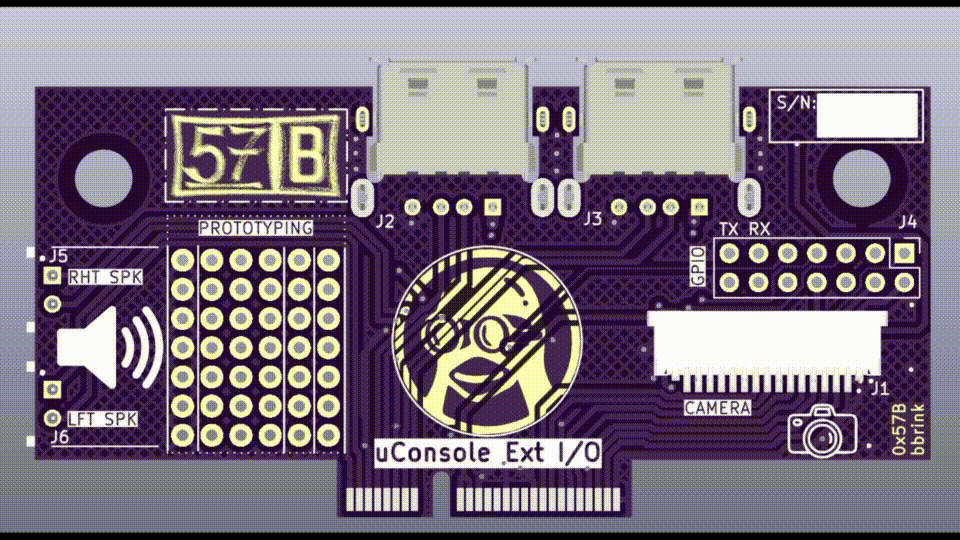

# uConsole External I/O Breakout - REV: A

## BEWARE!!! --- THIS DESIGN HAS NOT BEEN VERIFIED --- BEWARE!!!

This is a generic breakout board for ClockWorkPI's uConsole. I didn't order the cellular module, and wanted to use the external I/O slot. Here's the "REV: A" SWAG based off of renderings of the PCB.

I have not verified this design. Once I get the boards back from OshPark, stuffed, and tested on the uConsole; I'll tag a release. 

**Also, I don't work for CPI, and this is not an official board from them. I just threw their logo on there, since the uConsole is their gear. Show CPI some love, and checkout their products! :)**

https://www.clockworkpi.com/

https://github.com/clockworkpi/uConsole/blob/master/clockwork_Adapter_CM4_Schematic.pdf

https://github.com/clockworkpi/DevTerm/tree/main/Schematics

