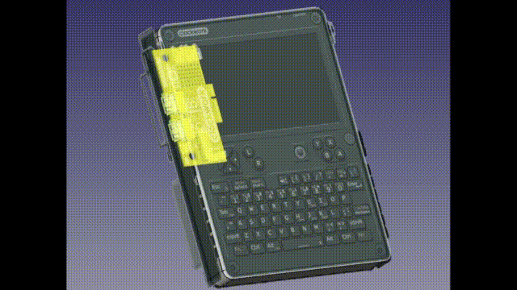

# uConsole External I/O Breakout - REV: A

## BEWARE!!! --- THIS DESIGN HAS NOT BEEN VERIFIED --- BEWARE!!!

This is a generic breakout board for ClockWorkPI's uConsole. I didn't order the cellular module, and wanted to use the external I/O slot. Here's the "REV: A" SWAG based off of renderings of the PCB.

I have not verified this design. Once I get the boards back from OshPark, stuffed, and tested on the uConsole; I'll tag a release. 

**Also, I don't work for CPI, and this is not an official board from them. I just threw their logo on there, since the uConsole is their gear. Show CPI some love, and checkout their products! :)**

https://www.clockworkpi.com/

https://github.com/clockworkpi/uConsole/blob/master/clockwork_Adapter_CM4_Schematic.pdf

https://github.com/clockworkpi/DevTerm/tree/main/Schematics

## REV: A

**Epic fail on REV: A.**

When I made it, CPI hadn't released the DXF for the 4G card yet. I had to eyeball the board outline based on the website images. I missed the outer edge by 1mm. 

Luckily the edge was just ground plane, and I was able to file the FR4 back to get it to fit. Continuity checks out, but.... I think a REV: B is in order ha.

The fixes for REV: B are:
* fix the board outline to account for the thicker enclosure wall
* refactor the audio so that the onboard speakers can be used instead of the JSTs
* flip the QWIIC connectors so they don't interfere with the speaker housings
* pull the USB connectors in a little so they're flush with the enclosure wall

## Notes

### Other boards made by Quadbit (Vitaly Domnikov), that you can buy on Tindie

* [uPico](https://www.tindie.com/products/quadbit/upico/)
  * [Src](https://github.com/dotcypress/upico)
* [uHub](https://www.tindie.com/products/quadbit/uhub/)
  * [Src](https://github.com/dotcypress/uhub)
 
